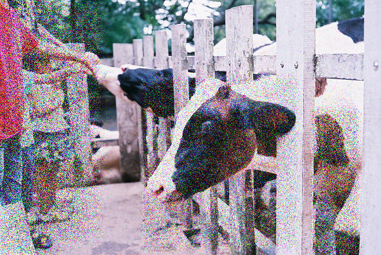

# Triple-Metric EvoAttack

Official implementation for paper **Generating Minimalist Adversarial Perturbations to Test Object-Detection Models: An Adaptive Multi-Metric Evolutionary Search Approach**. 

## Abstract 
Deep Learning (DL) models excel in computer vision tasks but can be susceptible to adversarial examples. This paper introduces Triple-Metric EvoAttack (TM-EVO), an efficient algorithm for evaluating the robustness of object-detection DL models against adversarial attacks. TM-EVO utilizes a multi-metric fitness function to guide an evolutionary search efficiently in creating effective adversarial test inputs with minimal perturbations. We evaluate TM-EVO using widely-used object-detection DL models, DETR and Faster R-CNN, and open-source datasets, COCO and KITTI. Our findings reveal that TM-EVO outperforms the state-of-the-art EvoAttack baseline, leading to better adversarial tests. TM-EVO's balance of effectiveness and efficiency represents an advancement in adversarial test generation.

## Installation

### Dependencies

Before installing the dependencies, it is recommended to create a virtual environement. If you are using `conda`, the following commands can be executed to create and activate the virtual environment. 
```
conda create --name TM-EVO python=3.9.17
conda activate TM-EVO
```
The required dependencies have been frozen in a `requirements.txt` file. Once the virtual environment has been created and activated, the following commande can be executed to install the dependencies.
```
pip install -r requirements.txt
```

### Data
We use the open-source high-quality dataset tool <a href="https://github.com/voxel51/fiftyone">Fiftyone</a> to download and load the <a href="https://www.cvlibs.net/datasets/kitti/">KITTI</a> and <a href="https://cocodataset.org/#home">COCO</a> datasets. A dataset is downloaded the first time an experiment which uses said dataset is executed. Once downloaded, subsequent executions of experiments will load the dataset. 

Note - The entire dataset will be installed even though only a subset of images will be used during experiments. 

### Models

We use object-detection models DETR and Faster R-CNN under test. We use the Huggingface implementation of <a href="https://huggingface.co/docs/transformers/v4.24.0/en/model_doc/detr">DETR</a> and the Pytorch implementation of <a href="https://pytorch.org/vision/master/models/faster_rcnn.html">Faster R-CNN</a>. A pretrained model is downloaded the first time an experiment which uses said model is executed. Once downloaded, subsequent executions of experiments will load the model.

## Run Experiments

We provide `experiments.py` with which experiments can run on a combination of algorithms, datasets and models.

### Arguments 

- `data_location` is a required argument. it is the file path to the root folder where the datasets will be saved. 
- `algs` is the algorithm that will be tested during the experiment. Available commands are EVO, TM_EVO or ALL.
- `datasets` is the dataset that will be tested during the experiment. Available commands are COCO, KITTI or ALL.
- `mdels` is the model that will be tested during the experiment. Available commands are DETR, FASTER or ALL.
- `dataset_size` is the number of images to process during the experiment. The default value is 10.
- `runs` is the number of runs per image to process during the experiment. The default value is 5.

The following arguments are available and will change the behaviour of the genetic algorithm.

- `population` is the population size. The default value is 32.
- `generations` is the max number of generations. The default value is 600.
- `p_mut` is the mutation probability. The default value is 0.012.
- `p_unmut` is the is the mutation reduction probability. The default value is 0.3.
- `delta` is the max degree of perturbation of a pixel when mutated. The default value is 0.4.

For example, the following command will run an experiments on both the DETR and FASTER R-CNN models, 5 images from the COCO dataset, will use the TM_EVO algorithm to perform the adversarial input generation, and only 1 run of the experiment will be performed on each image.
```
python experiment.py /path/to/dataset/root --algs TM_EVO --datasets COCO --dataset_size 5 --runs 1
```
A `logs` folder will be created automatically where information about the experiment will be saved using the following structure.

```
/logs
.    log_1/
.    .    parameters.txt
.    .    summary.txt
.    .    model/
.    .    .    adaptive/
.    .    .    .    dataset/
.    .    .    .    .    algorithm/
.    .    .    .    .    .    all_fitness_1.txt
.    .    .    .    .    .    all_norm_0_1.txt
.    .    .    .    .    .    all_norm_2_1.txt
.    .    .    .    .    .    fitness_1.txt
.    .    .    .    .    .    generations_1.txt
.    .    .    .    .    .    norm_0_1.txt
.    .    .    .    .    .    norm_2_1.txt
.    .    .    .    .    .    run_time_1.txt
.    .    .    .    .    .    ...
.    .    .    .    .    .    all_fitness_j.txt
.    .    .    .    .    .    all_norm_0_j.txt
.    .    .    .    .    .    all_norm_2_j.txt
.    .    .    .    .    .    fitness_j.txt
.    .    .    .    .    .    generations_j.txt
.    .    .    .    .    .    norm_0_j.txt
.    .    .    .    .    .    norm_2_j.txt
.    .    .    .    .    .    run_time_j.txt

    ...

.    log_i]
```
A `imgs` folder will be created automatically where information about the experiment will be saved using the following structure.

```
/imgs/
.    AEs/
.    .    [1]/
.    .    .    model/
.    .    .    .    dataset/
.    .    .    .    .    algorithm/
.    .    .    .    .    .    imgs1.png
.    .    .    .    .    .    ...
.    .    .    .    .    .    imgsk.png

        ...

.    .    i/
```

In the above file structure, `i` is the index of the current experiment,`j` is the number of runs of the experiment per image, and `k` is the number of images generated (number of images sampled from the experiment multiplied by the number of runs).

The files can be described as follows.
- `parameters.txt` is a file containing all the parameter information of the experiment.
- `summary.txt` is a summary of all the results of the experiment, including norm information and execution time.
- `all_fitness_j.txt` is a file containing all fitness history of the runs.
- `all_norm_0_j.txt` is a file containing all L0 norm history of the runs.
- `all_norm_2_j.txt` is a file containing all L2 norm history of the runs.
- `fitness_j.txt` is the final fitness of the runs (0 if successful).
- `generations_j.txt` is the number of generations passed by the algorithm.
- `norm_0_j.txt` is the final L0 norm of the runs.
- `norm_2_j.txt` is the final L2 norm  of the runs.
- `run_time_j.txt` is the execution time of the runs.
- `imgsk.png.txt` is an images that can be used as an adversarial input.

## Results

### Qualitative 

In section we compare adversarial test inputs generated by the baseline EvoAttack algorithm and our TM-EVO alogrithm on the KITTI and COCO datasets. 

#### KITTI 

<div align="center">
  
  
  <span style="text-align: center; display: inline-block; width:49%">(a)</span>
  <span style="text-align: center; display: inline-block; width:49%">(b)</span>
</div>

<div align="center">
  
  
  <span style="text-align: center; display: inline-block; width:49%">(c)</span>
  <span style="text-align: center; display: inline-block; width:49%">(d)</span>
</div>

<b>Figure 1:</b> Sucessfull adversarial test inputs for the KITTI dataset <b>(a)</b> Attack performed on the Faster R-CNN model with EvoAttack baseline <b>(b)</b> Attack performed on the Faster R-CNN model with our algorithm TM-EvoAttack <b>(c)</b> Attack performed on the Detr model with EvoAttack baseline <b>(d)</b> Attack performed on the Detr model with our algorithm TM-EvoAttack

#### COCO 

<div align="center">
  
  
  <span style="text-align: center; display: inline-block; width:49%">(a)</span>
  <span style="text-align: center; display: inline-block; width:49%">(b)</span>
</div>

<div align="center">
  
  
  <span style="text-align: center; display: inline-block; width:49%">(c)</span>
  <span style="text-align: center; display: inline-block; width:49%">(d)</span>
</div>

<b>Figure 2:</b> Sucessfull adversarial test inputs for the COCO dataset <b>(a)</b> Attack performed on the Faster R-CNN model with EvoAttack baseline <b>(b)</b> Attack performed on the Faster R-CNN model with our algorithm TM-EvoAttack <b>(c)</b> Attack performed on the Detr model with EvoAttack baseline <b>(d)</b> Attack performed on the Detr model with our algorithm TM-EvoAttack.

All images can be found in the `report` folder.

### Quantitative

In this section we show the quantitative results of our experiment. 

<div align="center">
  
</div>

<b>Figure 3:</b> Empirical evaluation on the datasets, models and algorithms.

All the data, along with the visuals, can be found in the data `report` folder. 

## License

This repository is released under the Apache 2.0 license as found in the LICENSE file.